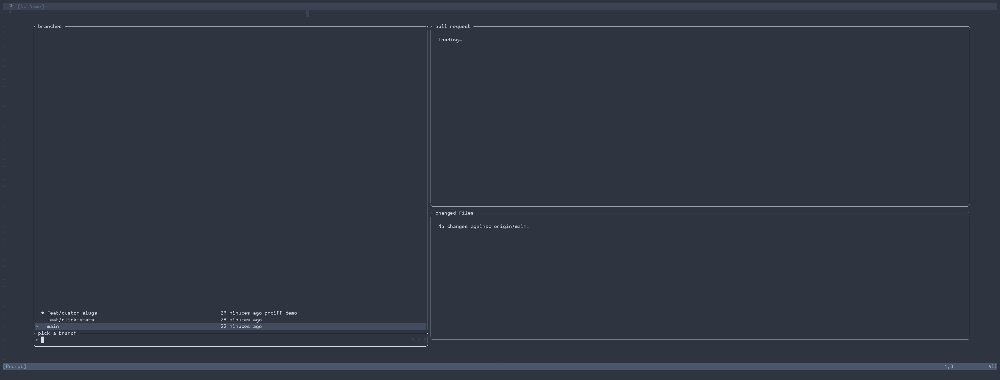
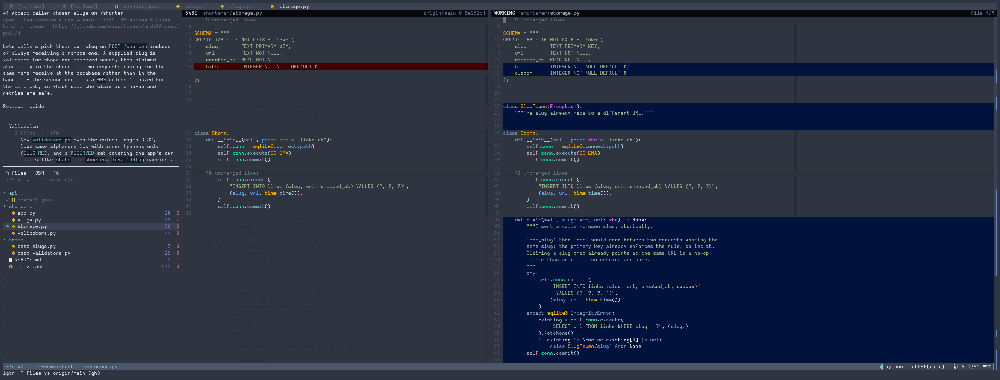

# lgtm.nvim

Review your branch's PR diff without leaving the editor — and fix things while
you're in there.



```
:LgtmEdit
```

Opens a tab with the file tree on the left and up to three screens beside it:

```
┌──────────────────┬──────────────────┬──────────────────┬───────────────────┐
│ #19624 ENG-9436… │                  │                  │                   │
│ open · → dev     │ BASE (read-only) │ WORKING          │ AI COMMENTS       │
│ +4997 −370       │ the file as it   │ (editable)       │ (on demand)       │
├──────────────────┤ is on the PR     │ the real file on │ per-hunk notes    │
│ changed files    │ target branch    │ disk — edit, :w  │ from an agent     │
│  81 files        │                  │                  │ that read the     │
│  12/81 viewed    │                  │                  │ repo              │
└──────────────────┴──────────────────┴──────────────────┴───────────────────┘
```

The left column carries the PR description above the file tree, the same way the
branch picker splits its right-hand side — what the PR says, then what it
touches. The description fills in when `gh` answers, so the session is usable
immediately rather than waiting on the network.

The third screen — AI comments, one block per change region, written by an agent
that has read the repository — is not open by default. Toggle it in with
`<leader>ge`. See [The AI comments column](#the-ai-comments-column) below.

The working pane is the actual working-tree file, so a fix is made in place
rather than noted for later. Diff highlighting, filler lines that keep the two
sides aligned, scroll locking and character-level intra-line marking all come
from Vim's built-in diff mode.

## Keys

| Key | Where | Action |
|---|---|---|
| `<PageDown>` / `<PageUp>` | any pane | next / previous changed file |
| `]f` / `[f` | any pane | same, alternate binding |
| `<End>` | any pane | toggle viewed — advances only when ticking |
| `<leader>ge` | any pane | toggle the AI comments column |
| `]c` / `[c` | diff panes | next / previous hunk (Vim built-in) |
| `<CR>` | tree | open file, or fold a directory |
| `m` | tree | toggle viewed |
| `za` | tree | fold / unfold directory |
| `q` | tree | close the session |

`<End>` is the only viewed-key and it is a plain toggle. The *direction* decides
whether you move:

- unviewed → **viewed**: advance to the next file
- viewed → **unviewed**: stay put, so you can un-tick and re-read

That one rule covers both burning down a long review and correcting a mistake.

## Which branch does it diff against?

First hit wins:

1. an explicit argument — `:LgtmEdit origin/release-2`
2. the PR's real target, via `gh pr view`
3. `base_branch` from your config
4. `origin/HEAD`
5. the first of `origin/dev`, `origin/main`, `origin/master` that exists

The comparison is against the **merge base**, so you see your changes rather than
everything that has landed on the target branch since you branched — the same
thing GitHub shows on the PR.

The diff runs against the **working tree**, not `HEAD`, so uncommitted edits show
up too and the panes update as you save.

## Viewed marks

Ticks persist in `stdpath("data")/lgtm/state.json`, keyed on the *shared* git
directory plus the branch name. In a bare-plus-worktrees layout that means review
progress follows the branch — check the same branch out in another worktree and
your ticks come with it.

Each mark stores a hash of the file when you ticked it. Edit that file and the
mark is dropped next time you open the session: a review of an older version of a
file is not a review of this one.

## Generated files

Files marked `-diff` or `linguist-generated` in `.gitattributes` are what GitHub
collapses in its PR view. They are pre-ticked so they stay out of your way, shown
with a `gen` tag, and skipped when `<End>` advances — but still reachable with
`<PageDown>` and still fully diffable, because the diffing is Vim's rather than
git's.

Note that `git diff --numstat` reports no counts for `-diff` files even though
they are ordinary text; such rows show `—` instead of `+N -M`. Genuinely binary
files are detected by looking for NUL bytes in the content, and get a placeholder
instead of a diff.

## Picking a branch

```
:LgtmPick
```

A Telescope picker over your local branches, with the PR description and the
branch's changed files side by side:

```
┌─ branches ──────────────────┬─ pull request ──────────────────────┐
│> ● eng-9436-inline-images…  │ #19624  ENG-9436: inline image refs │
│  ○ eng-10382-e2e-ui-review… │ open · eng-9436 → dev               │
│  ○ eng-10180-charts-show…   │ +4997 −370 across 81 files          │
│    eng-8151-retire-the-pro… │                                     │
│    jaron/eng-4986-import…   │ ## Temp environment                 │
├─ pick a branch ─────────────┼─ changed files ─────────────────────┤
│>                            │  81 files  +2315  -370              │
│                             │  10/81 viewed  ·  origin/dev        │
│                             │ ▾ backend/copilot/logic             │
└─────────────────────────────┴─────────────────────────────────────┘
```

`●` is the branch you are on, `○` has a worktree, unmarked has neither. The file
tree is the same one the diff view uses, and it carries your viewed progress, so
you can see how far into a review you already are before opening it.

On `<CR>`:

- **Has a worktree** — opens the diff view rooted there. The session's tab gets
  its own `tcd`, so nothing else in Neovim changes directory.
- **No worktree** — checks the branch out where you are, then opens. If anything
  is uncommitted this refuses and lists what is in the way rather than deciding
  for you; branches that already have a worktree are unaffected.

Telescope gives a picker one preview window, so the split is built with its
`create_layout` hook: the description is Telescope's preview, and the file tree
is a fourth window of ours filled from the same callback. `gh pr view` is a
network call and the file list costs a merge-base plus two diffs, so both are
cached per branch and fetched asynchronously behind a `loading…` placeholder.

### How the description is laid out

A PR body is written for a browser about a thousand pixels wide. Two things in
one break badly in a side pane, and neither is fixed by turning `wrap` on:

- **Paragraphs are single unbroken lines**, often several hundred characters.
- **Reviewer-guide tables reach ~700 characters a row**, nearly all of it prose
  in the last column. No column arithmetic rescues that — the table shape is what
  does not fit.

So text is wrapped to the pane (continuations indent under their bullet, which
`wrap` cannot do), and each table row is reflowed into a block: first column as
the heading, the short numeric columns as a meta line, prose underneath. Nothing
is dropped.

```
| Group | Num files | Aggregated LOC | What changed |          ← 700 cols
| Cross-editor `IMG. N` allocation (frontend) | 4 | +435 / -0 | The naming…

  Cross-editor IMG. N allocation (frontend)
    4 files  ·  +435 / -0
      The naming rule and both editors' walks over it.
      image-name-allocation.ts is the single statement of the rule…
```

Inline markup is stripped and re-applied as highlights rather than concealed, so
the text is measured *after* the markers are gone — wrapping around `**` and
backticks that are about to become invisible gives ragged, short-looking lines.
Headings lose their `#` and take a rule; `>` blockquotes become a `▏` gutter with
GitHub's `[!NOTE]` callouts labelled; fenced code passes through verbatim.

Inline `code` is marked with a faint background chip rather than a colour — a
description already carries headings, bold, italic and links, and a fifth hue
across 75 code spans reads as noise. The chip is built from the background's own
hue and lightness, so it tracks whatever colourscheme is loaded.

Two details that took a bug each to get right: markup **nests**, so ``**`code`**``
has to be recursed into rather than matched once, and underscore emphasis only
counts at a word boundary — otherwise `IMAGE_INDEX_001` renders as
`IMAGEINDEX001` and identifiers are silently mangled.

## The change ruler

A one-column strip down the right edge of the working pane marking where every
hunk sits in the file as a whole, with the current viewport highlighted:

```
  markdown_cache.py   +1  -1     ····A·····················A
  readable.py         +6  -2     ···AA··············A······A
  inline_image.py   +166 -27     AAAAA···AAAAAAAAA·AAAAAAAAA
```

Scrolling tells you what is under the cursor but never how much of the file is
involved, or whether this is one rewritten function or forty scattered one-line
edits. The ruler answers that without moving, so it doubles as a position
indicator.

It is a non-focusable float overlaying the pane's last column — the same approach
scrollbar plugins take — so `<C-w>w` still cycles only the three real windows.
Being a float it does belong to the tabpage, so it appears in
`nvim_tabpage_list_wins`; anything iterating the session's windows must skip it.
Turn it off with `ruler = false`.

## The AI comments column



```
:LgtmExplain          toggle           <leader>ge
:LgtmExplain!         regenerate just the file you are on
:LgtmExplainClearCache
```

The third screen, to the right of the working file — one block of AI comments
per change region, scrolling with it:

```
┌────────────────────────────┬──────────────────────────────────────┐
│  def build_name(idx):      │  ▌ 120–134   +15 −3                  │
│ -    return f"IMG {idx}"   │  Move the naming rule out of the walk│
│ +    return allocate(idx)  │    Both editors walked the document  │
│                            │    and formatted the label inline;   │
│                            │    `image-name-allocation.ts` is now │
│                            │    the single statement of the rule. │
│  def walk(doc):            │                                      │
│      for node in doc:      │  ▌ 402   +1 −1                       │
│ -        n = build_name(i) │    ↑ one change with 120–134         │
└────────────────────────────┴──────────────────────────────────────┘
```

Not created with the session — plenty of reviews do not want it, and it costs a
model call per file — so it is opened on demand and populated at that moment.

### One run for the whole PR, streamed a file at a time

One headless `claude -p` covers the entire change, spawned with `vim.system` so
nothing blocks. It is given the PR description, the stat for every file, and the
diff of the file you have open — then left alone: the other eighty it reads itself
with `git diff`, `Read` and `Grep` rather than being fed 5000 lines it may not look
at.

Only the open file's diff is pasted in, and that is a deliberate asymmetry. Pasting
all of them would be most of the cost of the run, but the first file is the one
whose explanation you are waiting on, and handing it the content directly means it
starts from what the change *is* rather than from whatever it decides to go and look
at first.

A call per file was the first design and it was the wrong one. It re-sent the
description and the stat on every one of them and re-explored the same shared code
eighty times over — most of the cost, none of the understanding. A hunk in one file
is often only explicable by what moved in another, and a per-file call cannot see
it. From a real run of the current design:

> Same issue as `OFFSET` above: `SCALE` has no definition anywhere in the repo.
> **Read alongside the OFFSET change in fn01/fn02** — likely both are meant to
> reference constants that were supposed to land in this PR but are missing.

**Results arrive one file at a time, because the agent writes them.** Each file's
explanation is a `Write` into a directory the plugin watches with
`vim.uv.new_fs_event`, so the pane fills in for that file the moment it lands
rather than when the run finishes. It is told to do the file you have open first
and to write as it goes rather than batching to the end. Measured on a two-file
fixture: first file at 24.8s, both at 27.3s.

That also paces the agent. Each file is a discrete tool call, not one enormous
reply that thins out towards the end — and because the results are files, a run
that times out, is cancelled, or degrades after autocompact leaves everything it
already wrote intact. Relaunching passes the finished list back as
`<already_done>`, so it resumes rather than repeating.

### The store

```
~/.cache/nvim/lgtm/explain/<branch>-<merge-base>-v<prompt>/
    backend__copilot__logic.json
    frontend__editor__image.json
    _shas.json
```

Named rather than hashed, so you can open it. One file per changed file, indexed
by the `path` field *inside* each one rather than by filename, so a slug the agent
got slightly wrong still lands correctly. The prompt version is in the directory
name because results produced by an older prompt are not results for this one.

`_shas.json` is the plugin's own; the agent owns the rest. It records the content
hash of each file when its explanation was first read, so a file you then edit in
the working pane is marked `stale` in the winbar — the old text stays on screen,
since a slightly outdated explanation still beats none.

Because the store is just files, a single file can be replaced without touching
the rest: `:LgtmExplain!` regenerates the one you are on, and the agent is told
to explain only that path. Verified not to rewrite its neighbours.

### It cannot write to your working tree

The results *are* writes, so the agent needs `Write` — which is worth being
careful about, given the right-hand pane is the real file and may have your unsaved
edits in it.

`Write` cannot be scoped through `--allowedTools`. Every parenthesised form of it
is refused outright — `Write(/abs/path/**)` and `Write(**)` both deny everything,
tested — and bare `Write` is unscoped. What does work is a **deny** rule passed
through `--settings`:

```json
{"permissions": {"deny": ["Write(//your/repo/**)", "Edit(//your/repo/**)", ...]}}
```

So the agent runs with the repo as its cwd (`git`, `Grep` and `Glob` all natural),
the store reachable via `--add-dir`, and every write tool denied inside the
repository. Probed directly: reading the repo ALLOWED, writing the store ALLOWED,
writing into the repo DENIED. A real run leaves `git status` byte-identical.

One CLI detail worth knowing if you tune `extra_args`: `--add-dir` and
`--allowedTools` are both variadic, so a prompt passed positionally after either
gets swallowed as another argument. The prompt goes on stdin regardless — which it
has to, since a PR body plus an 80-file stat is well past what an argument carries.

### Regions, not hunks

A block per raw hunk spends one on every *consequence* of a nearby edit. Delete
four lines and the line below them becomes its own `vim.diff` hunk, and it is not
its own change — the first real run of this said as much on its own: *"purely
mechanical: delta's body line shifts as a result of the gamma deletion above"*. A
block that says that is a block earning nothing.

So hunks are collapsed into **regions** first. Vim leaves `context` unchanged
lines unfolded either side of a change (`diffopt`, 6 when omitted, which is the
default), so two hunks separated by `2 × context` lines or fewer have no fold
between them and read as one contiguous block of change on screen. That is the
merge rule, and it is read off your live `diffopt` rather than assumed. On a
five-hunk file it gives three blocks; on a small file where nothing is folded at
all it gives one.

Two documented corners of `context` are handled: `context:0` means one line, not
zero, "since folds require a line in between", and `context:999999` is the
sanctioned way to switch folding off altogether — which would otherwise collapse a
whole file of scattered changes into a single block, so the merge distance is also
capped at the height of the pane. Two changes that cannot be on screen together
are not one region whatever the fold settings say.

### What it is told to explain

Two rules, both of which exist because their absence produced a wrong answer.

**The unit of review is the cumulative diff against the merge base, not the
branch's commits.** A branch that adds a file and then amends a line of it in a
later commit is, under review, a branch that adds a file. Left unsaid, an agent
will explain the *last commit* instead — a real report on a new Alembic migration
came back as a paragraph about `down_revision` being "the result of commit
e8c5de6ffb7", with the table the migration creates never mentioned. So citing a
commit hash is forbidden, `git log` is background rather than material, and
**`git blame` is not in the allow-list at all**: its entire output is which commit
touched which line, which is precisely what an explanation must never be about.

**Say what the change does first, every time — even when the diff makes it plain.**
The first version of this prompt said the opposite: *"an explanation that could have
been written from the diff alone is usually not worth the reviewer's time"*, and
*"do not restate the diff"*. For a new file, or a migration, or anything whose
content is largely boilerplate, that leaves the agent hunting for a non-obvious
insight to offer in place of the description — and a revision pointer's history is
what it finds. The plain description is the answer; what it affects elsewhere comes
after it, and a risk after that.

A migration, a config file or a generated artefact is explained the same way as
code: what it changes about the system. For a migration that means the table, its
columns, their nullability and what reads them — not its position in the revision
graph, unless the graph is what the change alters.

### Attached by line range

The agent cites line ranges in the new file, and they are mapped onto regions by
best overlap, with a few lines of slack for a citation that lands just off the end
of a block. Sending it a numbered region list instead would be exact, but it means
enumerating every hunk in the whole PR — a `git show` and a `vim.diff` per file —
before the agent can start, which is a stall on a pane you just asked to open.
Overlap is forgiving of the agent counting a boundary differently, which is the
only way the two could disagree.

Where several regions land on one explanation they become a group, stated once on
the first of them and pointing back at it from the others (`↑ one change with
120–134`), so one change made in three places reads as one piece of text. A block
per *group* would put the blocks out of file order the moment a group straddled an
ungrouped region, and anchors that are not monotonic cannot be interpolated
between. A region nothing cited shows `…` rather than borrowing its neighbour's
text.

### How it stays level with the diff

The explanation buffer is a **canvas indexed by the working pane's display rows**:
canvas line N is screen row N of the diff. So a block written at the row its region
sits on is level with it by construction, and scroll locking is a straight copy of
the scroll position rather than a guess.

That means folds, diff filler and padding need no special handling. All three are
already inside the number `nvim_win_text_height` returns, which is what the canvas
is measured in. A closed fold standing for four hundred unchanged lines is one row
in the diff and one blank line on the canvas.

`wrap` is off in the pane, and that is load-bearing rather than cosmetic — a line
that soft-wrapped would take two rows and put everything below it out by one. The
prose is hard-wrapped to the pane already, so the only thing this clips is a token
too long to break, which is an unspaced URL.

There is no "active block" highlight. An earlier version tinted the block belonging
to wherever you were, which was both a crutch for alignment that was only
approximate and, as it turned out, keyed on the top of the viewport rather than the
cursor. With the panes locked row for row, which explanation belongs to what you
are reading is answered by where it is.

The pane is focusable and syncing only ever pushes working → explanation, so you
can scroll it freely to read a long block without it snapping back.

### Making room

A closed fold collapses however many hundred unchanged lines to a single row, so
the rows the diff leaves beside a region are counted in the dozen — and a long
explanation does not fit in them. Compressing the prose is the wrong end to give:
the code panes are padded instead.

The shortfall is not estimated, it falls out of laying the canvas out. A block that
would run past the row its next region sits on reports the difference; the code
panes are padded by exactly that; the canvas is laid out again against the rows
that now exist. Two passes settle it — the first finds every shortfall, the second
sees the room it asked for.

The rows are **virtual** lines, not real ones: the working pane is the file itself,
and padding it with text would mean editing the thing under review. The buffer's
line count and modified flag are untouched, both asserted. They go into *both* code
panes at the same logical line — the end of the region's trailing context, where
the fold begins — because those context lines are unchanged and therefore common to
the two sides, so the same offset lands on the same row in each and the panes stay
level with one another. Measured: zero drift between base and working across a
padded region.

Three details that cost a probe each:

- **Never the buffer's final line.** Virtual lines attached there are not counted
  as display rows — `nvim_win_text_height` returns the unpadded number — so a
  region at the end of the file was being given room that did not exist. The attach
  point is clamped one line short.
- **`topfill` counts padding too, and the same rows are missing from the row count**
  — because of the quirk above. Subtracting one from the other removed the padding
  twice and put the pane exactly `pad` rows out, only ever while a padded region was
  at the top of the screen. So the scroll position is now *measured* with
  `screenpos` against a region line rather than calculated, and the pane's first
  drawn row is `screenpos(topline) - topfill`, not `screenpos(topline)`.
- Extmarks are buffer-scoped, so the namespace is pinned to the two panes with
  `nvim__ns_set` where Neovim offers it; otherwise the same file open in another tab
  would show the padding too.

Padding is the exception rather than the rule — a fold plus its context is usually
around eighteen rows and a 1-4 sentence body wraps to five. At the default width
these fixtures needed none at all; at 26 columns they needed two rows. Turn it off
with `pad = false`.

### Keeping the layout honest

Both of those measurements go stale on their own. Resize the pane and every block
re-wraps to a different height; open a fold and real rows appear where padding was
standing in for them. So the layout carries a signature — the pane's width, plus
the rows measured beside each region — checked on the session's scroll and cursor
autocmds. When it moves, a width change re-wraps the blocks and anything else
just re-measures the padding. Neither ever regenerates: it works from the answer
already in hand, so it costs no model call.

`CursorHold` is in that list as the backstop, because `zo` on a fold scrolls
nothing and need not move the cursor, so it is the one change that no other event
reliably reports.

The signature measures rows rather than probing the fold state, which is the
second thing here that cost a test. The first attempt asked whether the line after
a region was folded — and that line is always inside the region's own unfolded
context, so opening every fold in the file changed nothing it could see and the
padding stayed put.

### Cost

The run is launched when you toggle the pane in, and only for the files that have
no explanation yet — so a second session on the same branch costs nothing, and a
branch you left half-reviewed resumes rather than starting again.

It waits briefly for `gh pr view` before committing to a prompt, rather than
telling the agent there is no PR when the lookup is merely still in flight. Unlike
a per-file design there is no second chance at that: one run, one prompt.

Paging between files never cancels anything. The run is doing work for every file,
so leaving the one that started it is not a reason to throw the rest away.

One thing it does not do: `-p` prints nothing until the process exits, so the pane
shows a file count and a seconds counter rather than what the agent is currently
reading. `--output-format stream-json` would give live tool-by-tool progress.

## Reading the panes

Some deliberate quietening, all of it scoped to the session's windows so the rest
of Neovim is untouched:

- **No fold gutter.** Diff mode sets `foldcolumn=2`; it is empty except beside a
  closed fold, which the fold line already announces.
- **Fold lines say what they hide, not what they contain.** `⋯ 76 unchanged
  lines` rather than the stock `+-- 76 lines: @dataclass(frozen=True…` padded
  with dots — the first line of a region is the least useful thing to show when
  the point of the fold is that nothing in it changed.
- **Readable fold text.** Most colourschemes put `Folded`'s foreground at almost
  the same lightness as its own background (`#4C566A` on `#3B4252` under nord).
  This lifts the foreground clear of it.
- **A fainter `colorcolumn`**, since a full-strength stripe competes with the
  diff tints it crosses.

## Diff colours

Vim paints changed lines edge to edge — there is no option to clip the highlight
to the text — so stock colourscheme values read as saturated bars that compete
with the syntax colours underneath. lgtm replaces them with dark, low-saturation
tints derived from your theme's own diff hues, applied through a **per-window**
highlight namespace so the rest of Neovim's diffs are untouched.

Two consequences worth knowing:

- **Each pane is coloured by meaning.** Vim has a single `DiffChange` for both
  sides; because the namespace is per window, the base pane reads as removals and
  the working pane as additions. Stock diff mode shows a *green* bar in the base
  pane for a line you are deleting, which reads backwards.
- **The changed characters are the same hue as the line, one step lighter**,
  rather than a contrasting colour. A second hue in the mix is most of what makes
  stock diff colouring noisy. `diffopt` already defaults to `inline:char`, so this
  marks exactly the characters that differ.

Filler rows — the padding that keeps the two sides level — are near-invisible and
their `-` glyphs are hidden, since they are structure rather than content.

Turn the whole thing off with `diff_colors = false`, or tune `line_sat`,
`line_lift`, `word_sat` and `word_lift`.

## Setup

```lua
{
    dir = "~/dev/lgtm.nvim",
    dependencies = { "nvim-tree/nvim-web-devicons" },
    cmd = { "LgtmEdit", "LgtmClose", "LgtmPick", "LgtmExplain" },
    keys = { { "<leader>gd", "<cmd>LgtmEdit<CR>", desc = "PR diff review" } },
    config = function()
        require("lgtm").setup({})
    end,
}
```

### Options

```lua
require("lgtm").setup({
    base_branch = nil,          -- fallback when there's no PR and origin/HEAD is unset
    tree_width = 60,            -- width of the left column
    desc_height = 0.45,         -- fraction of it given to the PR description
    base_width = nil,           -- fixed width for the base pane; nil splits evenly
    include_untracked = true,   -- show files git doesn't know about yet
    advance = "next",           -- "next" | "next_unviewed" | "none"
    generated = "skip",         -- "skip" pre-ticks generated files; "show" doesn't
    max_file_size = 1024 * 1024,
    gh_timeout = 8000,
    ruler = true,               -- the change ruler; see below
    explain = {                 -- the AI comments column
        width = 76,
        cmd = { "claude" },     -- argv prefix; the headless flags are added
        model = "sonnet",       -- "" omits --model
        tools = { "Read", "Grep", "Glob", "Write", "Bash(git diff:*)",
                  "Bash(git log:*)", "Bash(git show:*)" },  -- no blame; see above
        extra_args = {},        -- anything else to pass the CLI
        timeout = 1800000,      -- the whole run, not the first file
        max_diff_bytes = 60000, -- cap on the one diff pasted into the prompt
        pad = true,             -- reserve display rows for a tall explanation
        pr_wait = 3000,         -- how long to wait for gh before giving up on it
    },
    diff_colors = {             -- false keeps your colourscheme's own diff colours
        -- hue in degrees; line_l/word_l are lightness offsets from the
        -- background, negative meaning darker than it
        add    = { hue = 202, sat = 0.97, line_l = -0.079, word_l = -0.020 },
        delete = { hue = 0,   sat = 0.97, line_l = -0.037, word_l =  0.021 },
        filler = { l = 0.05 },  -- hue/sat follow the background unless set
        fold = { bg_l = 0.035, fg_l = 0.30 },
        colorcolumn = { l = 0.022 },
        background = nil,       -- set if your theme leaves Normal's bg unset
    },
    keys = { ... },             -- see defaults in lua/lgtm/init.lua
})
```

Set `LGTM_NO_GH=1` in the environment to skip the `gh` lookup entirely.

## Requirements

- Neovim 0.10+ (`vim.system`). Developed against 0.12.
- `git`
- `gh`, optional — only for detecting the PR's real target branch
- `claude`, optional — only for the AI comments column
